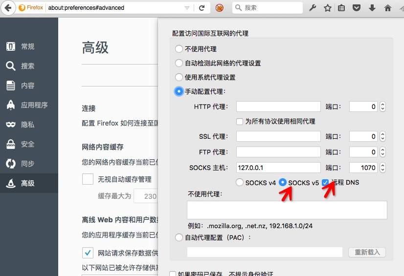

Python Socks5 Proxy
========================

:Date: 04/28 2016

.. contents::

简介
------

一个基于Python写的Socks5代理脚本。

使用
------

直接使用：

.. code:: bash

    git clone https://github.com/LuoZijun/python-proxy
    cd python-proxy
    python sock5.py

然后在你的浏览器当中的网络设置里，填上 代理地址： `127.0.0.1`，端口：`1070`。

最后勾上 `SOCKS 5` 和 `远程DNS`选项。

.. image:: sock5s.png

在你的代码当中引用：

.. code:: python

    ip, port = ("127.0.0.1", 1070)
    sock5    = Sock5(ip=ip, port=port)

    sock5.run()

依赖
-------

1.  select
2.  logging
