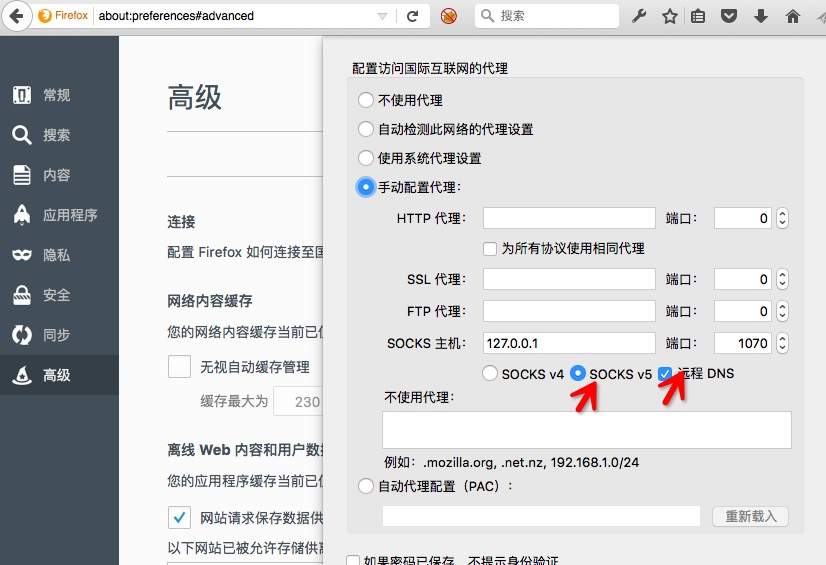
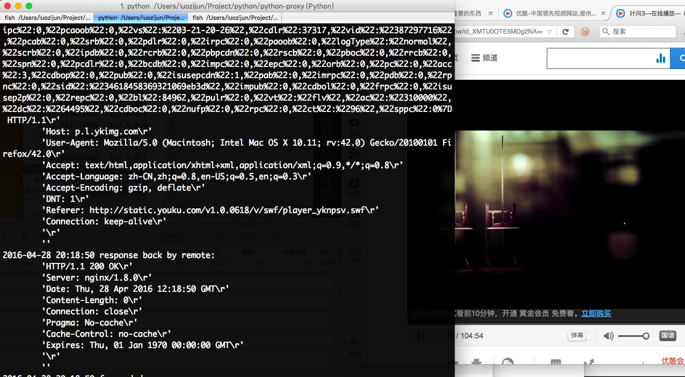

Python Socks5 Proxy
========================

:Date: 04/28 2016

.. contents::

简介
------

一个基于Python写的Socks5代理脚本。

使用
------

直接使用：

.. code:: bash

    git clone https://github.com/LuoZijun/python-proxy
    cd python-proxy
    python -m proxy

然后在你的浏览器当中的网络设置里，填上 代理地址： `127.0.0.1` ，端口： `1070` 。

最后勾上 `SOCKS 5` 和 `远程DNS` 选项。

在你的代码当中引用：

.. code:: python
    
    from proxy import Proxy

    if __name__ == '__main__':
        host  = "0.0.0.0"
        port  = 1070
        proxy = Proxy(host=host, port=port)
        proxy.run()

参考
-----------

SOCKS:

*   `SOCKS (Wikiedia) <https://en.wikipedia.org/wiki/SOCKS>`_

*SOCKS 5*

*   `RFC 3089 <https://tools.ietf.org/html/rfc3089>`_ , A SOCKS-based IPv6/IPv4 Gateway Mechanism
*   `RFC 1961 <https://tools.ietf.org/html/rfc1961>`_ , GSS-API Authentication Method for SOCKS Version 5
*   `RFC 1929 <https://tools.ietf.org/html/rfc1929>`_ , Username/Password Authentication for SOCKS V5
*   `RFC 1928 <https://tools.ietf.org/html/rfc1928>`_ , SOCKS Protocol Version 5
*   `draft-ietf-aft-socks-chap-01 <https://tools.ietf.org/html/draft-ietf-aft-socks-chap-01>`_ , Challenge-Handshake Authentication Protocol for SOCKS V5

*SOCKS 4*

*   `SOCKS4.protocol <http://ftp.icm.edu.pl/packages/socks/socks4/SOCKS4.protocol>`_ ,   SOCKS: A protocol for TCP proxy across firewalls | `OpenSSH Socks4 <http://www.openssh.com/txt/socks4.protocol>`_
*   `SOCKS4A.protocol <http://ftp.icm.edu.pl/packages/socks/socks4/SOCKS4A.protocol>`_ , SOCKS 4A: A  Simple Extension to SOCKS 4 Protocol | `OpenSSH Socks4a <http://www.openssh.com/txt/socks4a.protocol>`_

*   `More <https://tools.ietf.org/googleresults?cx=011177064926444307064%3Arsqif7nmmi0&q=socks&sa=Google+Search&cof=FORID%3A9&siteurl=tools.ietf.org%2Fhtml%2F&ref=&ss=583j88683j5>`_

HTTP 1.1:

*   `Hypertext Transfer Protocol (Wikipedia) <https://en.wikipedia.org/wiki/Hypertext_Transfer_Protocol#History>`_

*   `RFC 7230 <https://tools.ietf.org/html/rfc7230>`_ , Hypertext Transfer Protocol (HTTP/1.1): Message Syntax and Routing
*   `RFC 7231 <https://tools.ietf.org/html/rfc7231>`_ , Hypertext Transfer Protocol (HTTP/1.1): Semantics and Content
*   `RFC 7232 <https://tools.ietf.org/html/rfc7232>`_ , Hypertext Transfer Protocol (HTTP/1.1): Conditional Requests
*   `RFC 7233 <https://tools.ietf.org/html/rfc7233>`_ , Hypertext Transfer Protocol (HTTP/1.1): Range Requests
*   `RFC 7234 <https://tools.ietf.org/html/rfc7234>`_ , Hypertext Transfer Protocol (HTTP/1.1): Caching
*   `RFC 7235 <https://tools.ietf.org/html/rfc7235>`_ , Hypertext Transfer Protocol (HTTP/1.1): Authentication
*   `draft-luotonen-web-proxy-tunneling-01 <https://tools.ietf.org/html/draft-luotonen-web-proxy-tunneling-01>`_ , Tunneling TCP based protocols through Web proxy servers

*   `More <https://tools.ietf.org/googleresults?cx=011177064926444307064%3Arsqif7nmmi0&q=socks&sa=Google+Search&cof=FORID%3A9&siteurl=tools.ietf.org%2Fhtml%2F&ref=&ss=583j88683j5>`_

HTTP 2.0:

*   `Official website <https://http2.github.io/>`_
*   `HTTP/2 (Wikipedia) <https://en.wikipedia.org/wiki/HTTP/2>`_

*   `RFC 7540 <https://tools.ietf.org/html/rfc7540>`_ , Hypertext Transfer Protocol Version 2 (HTTP/2)
*   `RFC 7541 <https://tools.ietf.org/html/rfc7541>`_ , HPACK: Header Compression for HTTP/2
*   `draft-mbelshe-httpbis-spdy-00 <https://tools.ietf.org/html/draft-mbelshe-httpbis-spdy-00>`_ , SPDY Protocol: draft-mbelshe-httpbis-spdy-00

TLS/SSL:

`安全套接层` （英语：Secure Sockets Layer，缩写：SSL）为 `传输层安全协议` （英语：Transport Layer Security，缩写：TLS）的前身。

`TLS` 基于 `SSL 3.0` 演化而来。

*   `Transport Layer Security (TLS, Wikipedia) <https://en.wikipedia.org/wiki/Transport_Layer_Security#History_and_development>`_

*SSL 3.0*

*   `RFC 6101 <https://tools.ietf.org/html/rfc6101>`_ , The Secure Sockets Layer (SSL) Protocol Version 3.0

*TLS 1.0*

*   `RFC 2246 <https://tools.ietf.org/html/rfc2246>`_ , The TLS Protocol Version 1.0
*   `RFC 3546 <https://tools.ietf.org/html/rfc3546>`_ , Transport Layer Security (TLS) Extensions
*   `RFC 5746 <https://tools.ietf.org/html/rfc5746>`_ , Transport Layer Security (TLS) Renegotiation Indication Extension
*   `RFC 6176 <https://tools.ietf.org/html/rfc6176>`_ , Prohibiting Secure Sockets Layer (SSL) Version 2.0
*   `RFC 7465 <https://tools.ietf.org/html/rfc7465>`_ , Prohibiting RC4 Cipher Suites
*   `RFC 7507 <https://tools.ietf.org/html/rfc7507>`_ , TLS Fallback Signaling Cipher Suite Value (SCSV): for Preventing Protocol Downgrade Attacks

*TLS 1.1*

*   `RFC 4346 <https://tools.ietf.org/html/rfc4346>`_ , The Transport Layer Security (TLS) Protocol Version 1.1
*   `RFC 4366 <https://tools.ietf.org/html/rfc4366>`_ , Transport Layer Security (TLS) Extensions
*   `RFC 4680 <https://tools.ietf.org/html/rfc4680>`_ , TLS Handshake Message for Supplemental Data
*   `RFC 4681 <https://tools.ietf.org/html/rfc4681>`_ , TLS User Mapping Extension
*   `RFC 5746 <https://tools.ietf.org/html/rfc5746>`_ , Transport Layer Security (TLS) Renegotiation Indication Extension
*   `RFC 6176 <https://tools.ietf.org/html/rfc6176>`_ , Prohibiting Secure Sockets Layer (SSL) Version 2.0
*   `RFC 7465 <https://tools.ietf.org/html/rfc7465>`_ , Prohibiting RC4 Cipher Suites
*   `RFC 7507 <https://tools.ietf.org/html/rfc7507>`_ , TLS Fallback Signaling Cipher Suite Value (SCSV): for Preventing Protocol Downgrade Attacks

*TLS 1.2*

*   `RFC 5246 <https://tools.ietf.org/html/rfc5246>`_ , The Transport Layer Security (TLS) Protocol Version 1.2
*   `RFC 5746 <https://tools.ietf.org/html/rfc5746>`_ , Transport Layer Security (TLS) Renegotiation Indication Extension
*   `RFC 5878 <https://tools.ietf.org/html/rfc5878>`_ , Transport Layer Security (TLS) Authorization Extensions
*   `RFC 6176 <https://tools.ietf.org/html/rfc6176>`_ , Prohibiting Secure Sockets Layer (SSL) Version 2.0
*   `RFC 7465 <https://tools.ietf.org/html/rfc7465>`_ , Prohibiting RC4 Cipher Suites
*   `RFC 7507 <https://tools.ietf.org/html/rfc7507>`_ , TLS Fallback Signaling Cipher Suite Value (SCSV): for Preventing Protocol Downgrade Attacks
*   `RFC 7568 <https://tools.ietf.org/html/rfc7568>`_ , Deprecating Secure Sockets Layer Version 3.0
*   `RFC 7627 <https://tools.ietf.org/html/rfc7627>`_ , Transport Layer Security (TLS) Session Hash and Extended Master Secret Extension
*   `RFC 7685 <https://tools.ietf.org/html/rfc7685>`_ , A Transport Layer Security (TLS) ClientHello Padding Extension

*TLS 1.3*

.. Note:: `TLS 1.3` 目前处于草案阶段，最后更新是 2016/03/21

*   `draft-ietf-tls-rfc5246-bis-00 <https://tools.ietf.org/html/draft-ietf-tls-rfc5246-bis-00>`_ , The Transport Layer Security (TLS) Protocol Version 1.3 : draft-ietf-tls-rfc5246-bis-00
*   `draft-ietf-tls-tls13-12 <https://tools.ietf.org/html/draft-ietf-tls-tls13-12>`_ , The Transport Layer Security (TLS) Protocol Version 1.3 : draft-ietf-tls-tls13-12

